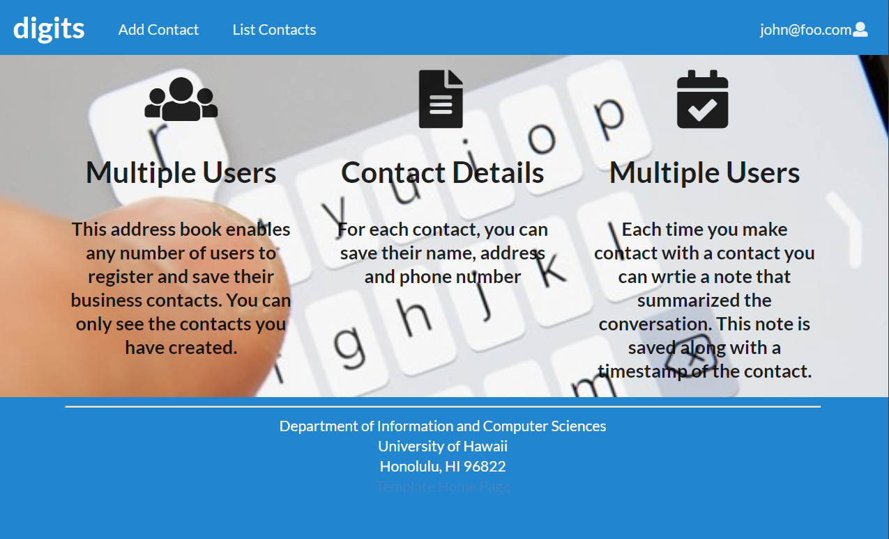
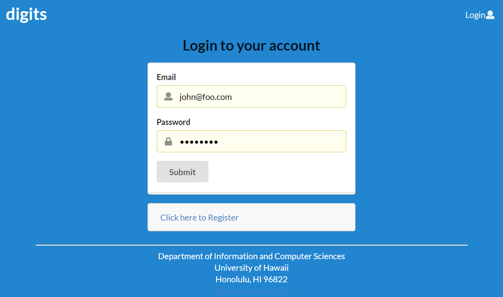
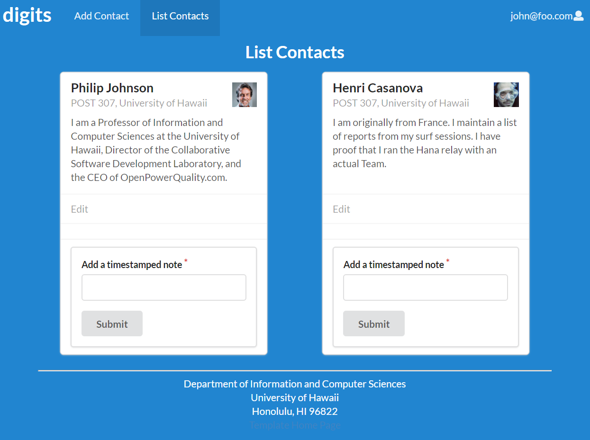
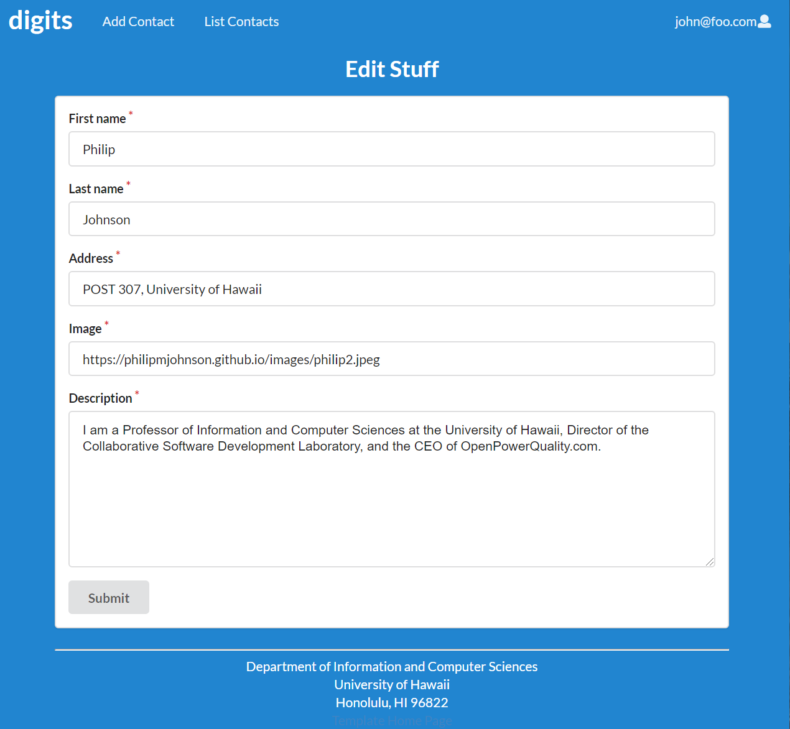
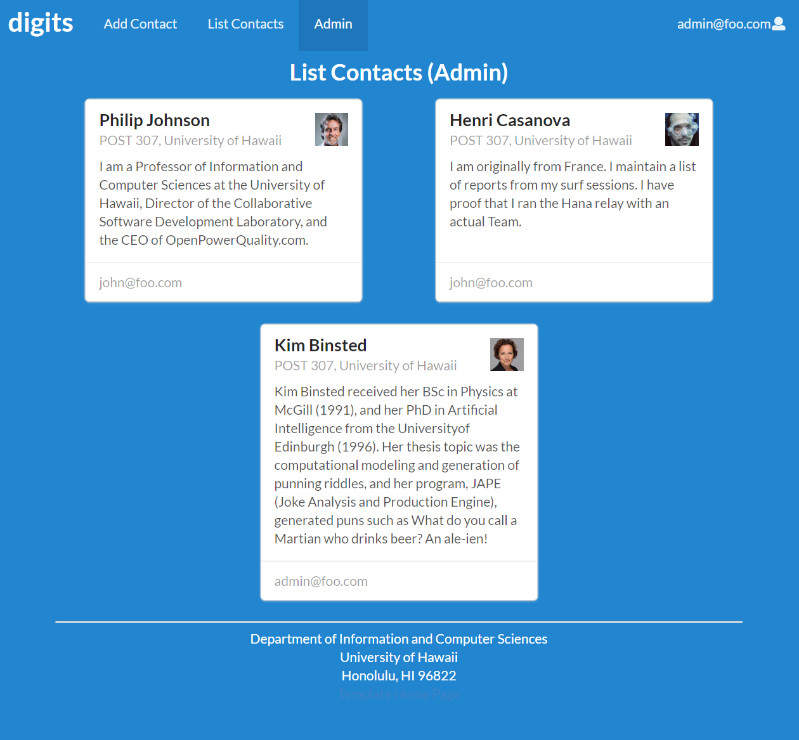

#Welcome to Digits!
<p>Digits is an application that allows users to:</p>

<ul>
  <li>Register an account.</li>
  <li>Create and manage a set of contacts.</li>
  <li>Add a set of timestamped notes regarding their interactions with each contact.</li>
</ul>
<h2>Installation</h2>

First, [install Meteor](https://www.meteor.com/install).

Second, go to (https://github.com/aujared/digits), and click click the "Clone or download" button to download your new GitHub repo to your local file system.  Using [GitHub Desktop](https://desktop.github.com/) is a great choice if you use MacOS or Windows.

Fourth, cd into the app/ directory of your local copy of the repo, and install third party libraries with:

```
$ meteor npm install
```

## Running the system

Once the libraries are installed, you can run the application by invoking the "start" script in the [package.json file](https://github.com/ics-software-engineering/meteor-application-template-react/blob/master/app/package.json):

```
$ meteor npm run start
```

The first time you run the app, it will create some default users and data. Here is the output:

```
meteor npm run start

> meteor-application-template-react@ start /Users/philipjohnson/github/ics-software-engineering/meteor-application-template-react/app
> meteor --no-release-check --settings ../config/settings.development.json

[[[[[ ~/github/ics-software-engineering/meteor-application-template-react/app ]]]]]

=> Started proxy.
=> Started MongoDB.
I20180227-13:33:02.716(-10)? Creating the default user(s)
I20180227-13:33:02.742(-10)?   Creating user admin@foo.com.
I20180227-13:33:02.743(-10)?   Creating user john@foo.com.
I20180227-13:33:02.743(-10)? Creating default data.
I20180227-13:33:02.743(-10)?   Adding: Basket (john@foo.com)
I20180227-13:33:02.743(-10)?   Adding: Bicycle (john@foo.com)
I20180227-13:33:02.743(-10)?   Adding: Banana (admin@foo.com)
I20180227-13:33:02.744(-10)?   Adding: Boogie Board (admin@foo.com)
=> Started your app.

=> App running at: http://localhost:3000/
```
##A Tour of Digits
<h2>Landing Page</h2>
When you first bring up the application, you will see the landing page that provides a brief introduction to the capabilities of Digits:

<h2>Login</h2>
If you do not yet have an account on the system, you can register by clicking on “Login”, then “Sign Up”:

<h2>List Contacts</h2>
Clicking on the List Contacts link brings up a page that lists all of the contacts associated with the logged in user:

<h2>Edit Contacts</h2>
From the List Contacts page, the user can click the “Edit” link associated with any Contact to bring up a page that allows that Contact information to be edited:

<h2>Admin Mode</h2>
It is possible to designate one or more users as “Admins” through the settings file. When a user has the Admin role, they get access to a special NavBar link that retrieves a page listing all Contacts associated with all users:


